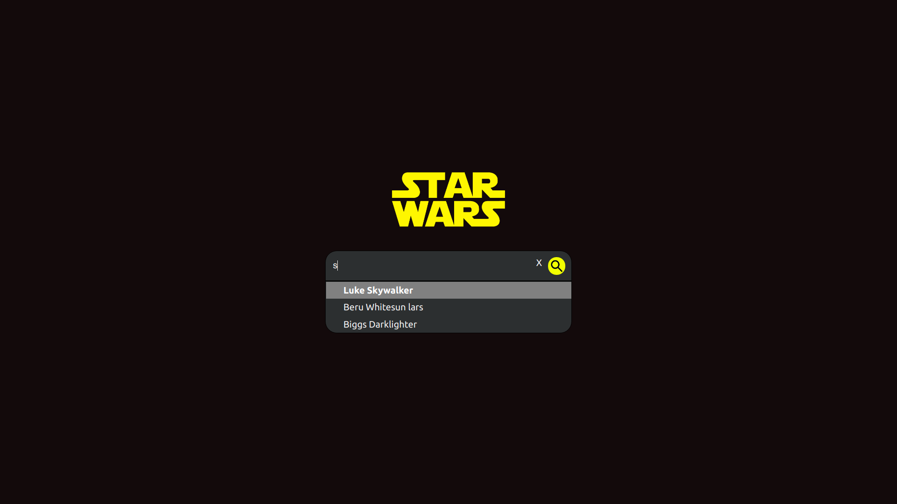
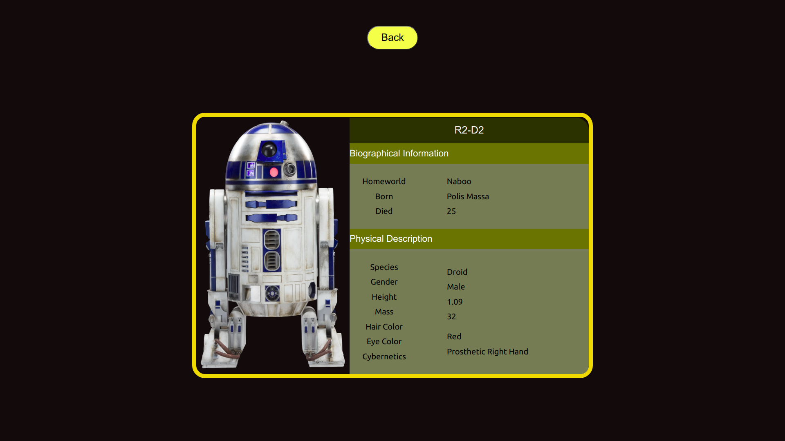

<h1 align="center">Live Search Componet on Star War API</h1>


## Live Version

https://starwars-autosearch.netlify.app/


## 1—Search Component
 
  
  
## 2—Character Page
 


## Installing and Running
The repository contains a minimal scaffolding created with [Create React App](https://github.com/facebook/create-react-app). This is only meant as
a starting point and you are free to change the structure if you wish. 

1. To get started, install your dependencies
```
yarn install
```

2. Run the app in development mode
```
yarn start
```


👤 **HR Shrayank**

- Github: [@hrshrayank](https://github.com/hrshrayank)
- Twitter: [@hrshrayank77](https://twitter.com/hrshrayank77)
- Linkedin: [H R Shrayank](https://www.linkedin.com/in/h-r-shrayank-2b04311b9/)
- Email: (hrshrayank77@gmail.com)
